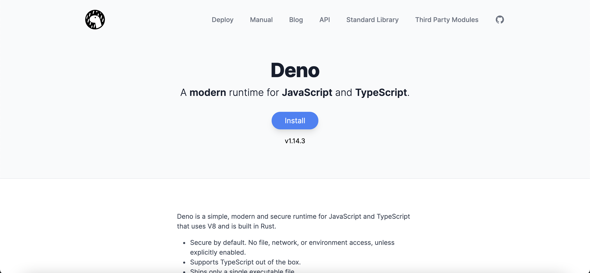
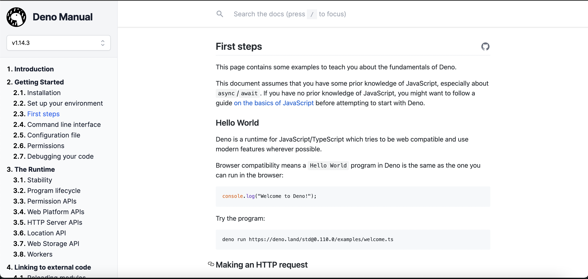
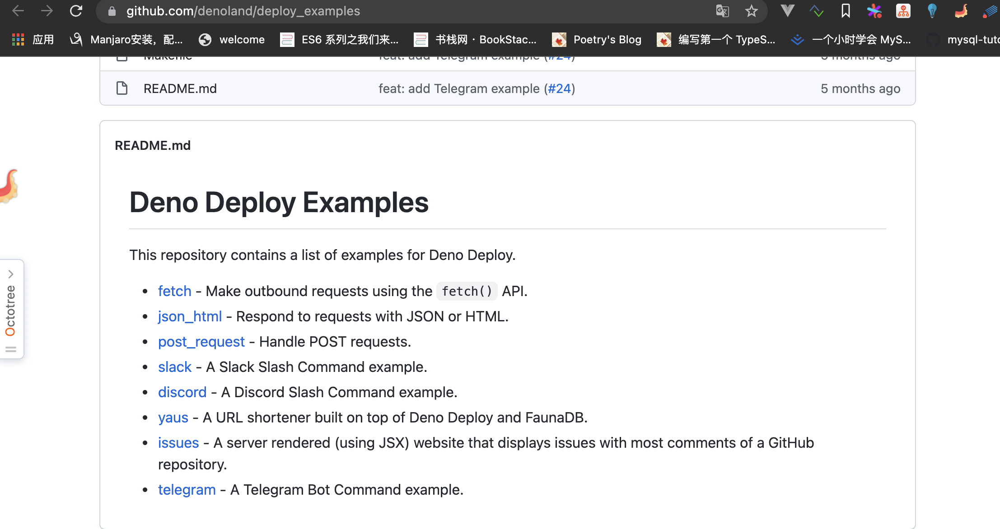

# the-craft-of-selfteaching

自学是门手艺

> 参考: https://github.com/selfteaching/the-craft-of-selfteaching

> 本书通过以下几种语言的讲解，来教会大家如何掌握自学这门手艺

1. java
2. python
3. javascript
4. deno
5. rust
6. go
7. shell

相关文档地址：

1. [rust](https://github.com/wuhaohao1234/rust-docs)
2. [deno](https://github.com/wuhaohao1234/deno-docs)
3. [python](https://github.com/wuhaohao1234/python-handlebook) (后期会重写)
4. [go](https://github.com/wuhaohao1234/golang-handlebook) (后期会重写)

剩余没有提到的会补上，所有文档使用dendron查看

[dendron handlebook](https://github.com/wuhaohao1234/study-dendron-docs)

这里先做下自我介绍：

<table>
  <tr>
    <td>姓名</td>
    <td>吴昊昊</td>
  </tr>
  <tr>
    <td>出生日期</td>
    <td>1996年</td>
  </tr>
  <tr>
    <td>职业</td>
    <td>全干工程师</td>
  </tr>
  <tr>
    <td>b站</td>
    <td>阿布0418</td>
  </tr>
  <tr>
    <td>爱好</td>
    <td>开源 or 阅读</td>
  </tr>
  <tr>
    <td>开发模式</td>
    <td>敏捷开发</td>
  </tr>
  <tr>
    <td>编码</td>
    <td>函数式编程 or tdd</td>
  </tr>
</table>

## 绪论

一直想写本关于学习的书，主要讲如何自学，但是一直没有迟迟下笔, 在工作这么多年，我深刻的理解到作为新人不管是对于学习还是职业规划都缺乏一套完善的思维模型

## 谈如何学习

上大学的时候，大家都是老师在教如何学习一门编程语言，所以在一开始的初心就是为了应付一门考试而被迫学习

这里有几个弊端

1. 老师的编程能力极差，一堂课程中，只是对着书本念老旧的api，甚至书也是很烂的书，里面的很多知识点早已过时

2. 国内的教材对于新人极度不友好

3. 学生不知道学完这个具体可以做什么，不知道为何而学

4. 很多时候，并不是学生笨，而是老师太垃圾。不然也不会存在很多大学生毕业后找不到工作去培训班学习（我承认大多数培训班也很烂，但是这也是没有办法的事情）

5. 学生的自学能力极差

毕业后到了工作岗位，我看到了很多程序员学习编程的方式竟然是看着教学视频学习，视频质量低下浪费时间不说，很多视频的讲师编程能力也是屈指可数，甚至讲的很多知识点都是错误的

我目前所掌握的方法有以下几种

1. kwhl
2. 康奈尔笔记法
3. pdca工作法
4. 黄金圈理论

综合以上，我对于一门新的编程语言的学习技巧如下

1. 打开一门语言的英文官方文档，这里一定要是英文，不能是中文，如果牵扯翻墙的问题自行解决

这里拿deno来举例

通过以上信息，我得知
  - deno是什么
  - deno有什么特性

这个时候我开始安装，并按照官方文档写下了hell world

然后我按照文档跑了几个实例，感觉很简单

这个时候我就可以把官方文档丢到一边了，因为我对于官方文档已经有了一定的认识，剩下的我也不想认识太多

这个时候我会在github上搜索下deno有哪些example，并且我可以直接使用的(如果不用，为什么学deno呢)

这个时候，我想看看deno如何做后端服务的，具体的可以看

issues,post_request,fetch,json_html

看完以上，我需要具体做个项目

这个时候，我会去知乎里面看看有没有相应的资源

https://zhuanlan.zhihu.com/p/148422528

看完以上，基本就可以干活了

对于脑子可以的程序员，不到半天时间就可以上手一门语言

下面是github

https://github.com/wuhaohao1234/deno-docs